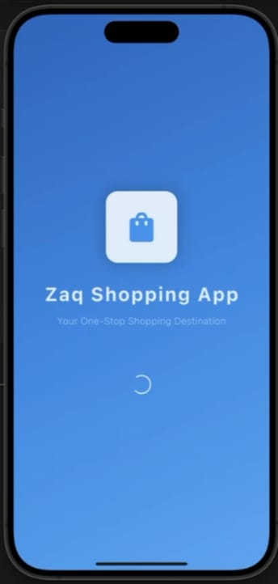
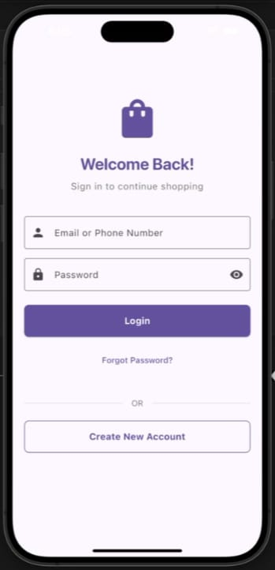
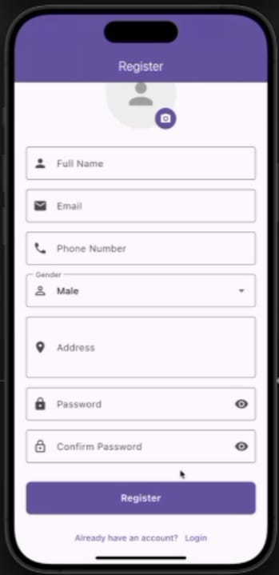
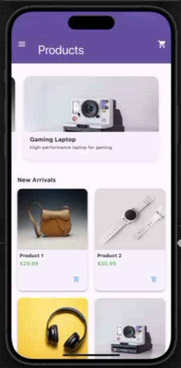
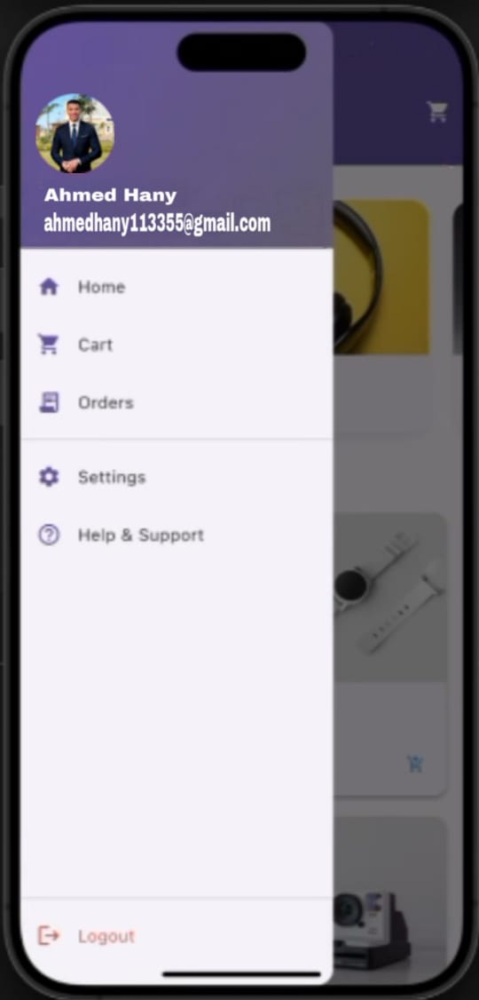
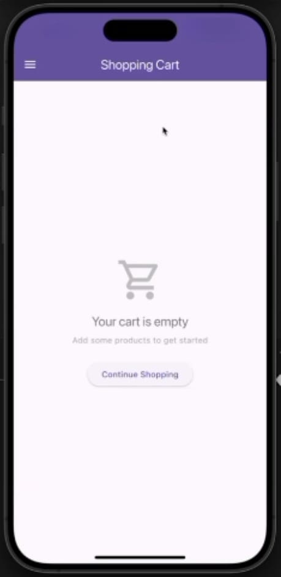
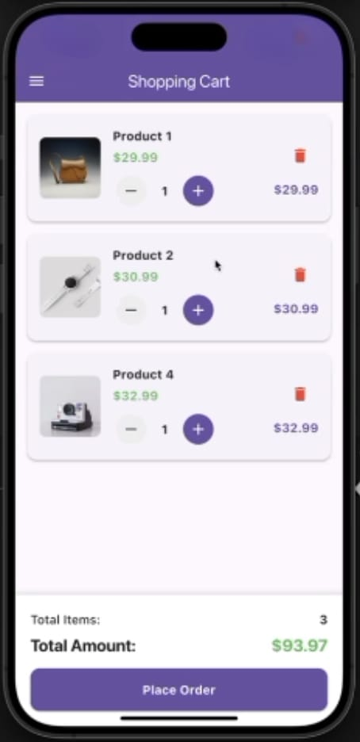

🛍 Flutter E-Commerce App

A sleek and scalable Flutter-based e-commerce application, built with a focus on modern UI/UX, robust state management, and Firebase-powered backend. This app aims to deliver a seamless shopping experience with advanced features, dynamic navigation, and real-time responsiveness.

> 🔧 Developed under the supervision and technical guidance of Eng. Ahmed Hany El-Sayed — a dedicated software engineering student passionate about mobile development and clean architecture.

---

📲 App Overview

This application allows users to:

Register and manage their account.

Browse, filter, and like products.

Add items to cart and place orders.

Manage wishlists and view profile data.

Built entirely in Flutter, structured for scalability, and integrates Firebase for authentication and real-time database storage.

---

🔐 Authentication Module

🔑 Login Screen

Secure login interface including:

Email & password inputs

Toggle to hide/show password

Login button

Navigation to the register screen

📝 Register Screen

Rich registration form capturing:

First/Last name, Email, Password

Phone number, Address

Gender selection (Male/Female)

Birthdate with date picker

Input validation for clean data

---

👤 User Profile Screen

Displays:

Avatar or initials

Full name

Email, phone, gender, address

Birthdate
Accessed from the side drawer.

---

🏪 Store Core Features

🏠 Products Home Screen

Dynamic and user-friendly layout including:

App bar with hamburger & cart icons

Featured banners (Smart Watch, Wireless Headphones, etc.)

“New Arrivals” in grid layout

Each product card includes:

Image, name, price

Favorite (heart) icon

Add-to-cart shortcut

Sorting options by price or name (A-Z / Z-A)

---

📦 Product Details Page

Includes:

Large product image

Price, title, and description

Add to cart button

Sections: Details, Reviews, FAQs, Related Items, Shipping Info

---

🧺 Shopping Cart Page

Features:

List of selected products with quantities

Edit item count (+ / -)

Total calculation

Place order button

Order confirmation popup

---

⚙ Advanced Features

📂 Navigation Drawer

Fast access to:

Home

Cart (with total)

Orders

Settings

Support

Watchlist

Logout

Includes user info at the top of the drawer.

---

⭐ My Watchlist Page

Displays all liked products.
Includes menu options:

“Clear All”

“Add All to Cart”

---

🧠 Technical Stack

🔄 State Management

Using Provider for:

Cart & Wishlist state

Auth & user session

🗂 Local Storage

Using shared_preferences for:

Login session

Temporary wishlist

🖼 Assets & Images

Images are optimized with cached_network_image for performance

🔥 Firebase Integration

Authentication (login/register)

Firestore (realtime DB)

Storage (image uploads)

---

👨‍💻 Developer Info

> 👨‍💼 Project Supervisor: Eng. Ahmed Hany El-Sayed
🎓 BSc in Computer Science – Specializing in Aviation Information Systems
🧠 Flutter Developer | Firebase Enthusiast | Backend Integrator
💡 Passionate about building real-world mobile solutions that scale.

---

💬 Final Notes

This project reflects practical application of clean Flutter development, modular architecture, and full-stack thinking. Developed as part of a learning journey but built to production-ready standards.

---
📸 project photos 

